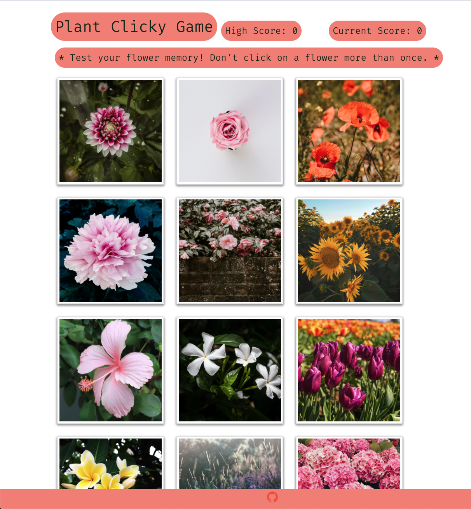
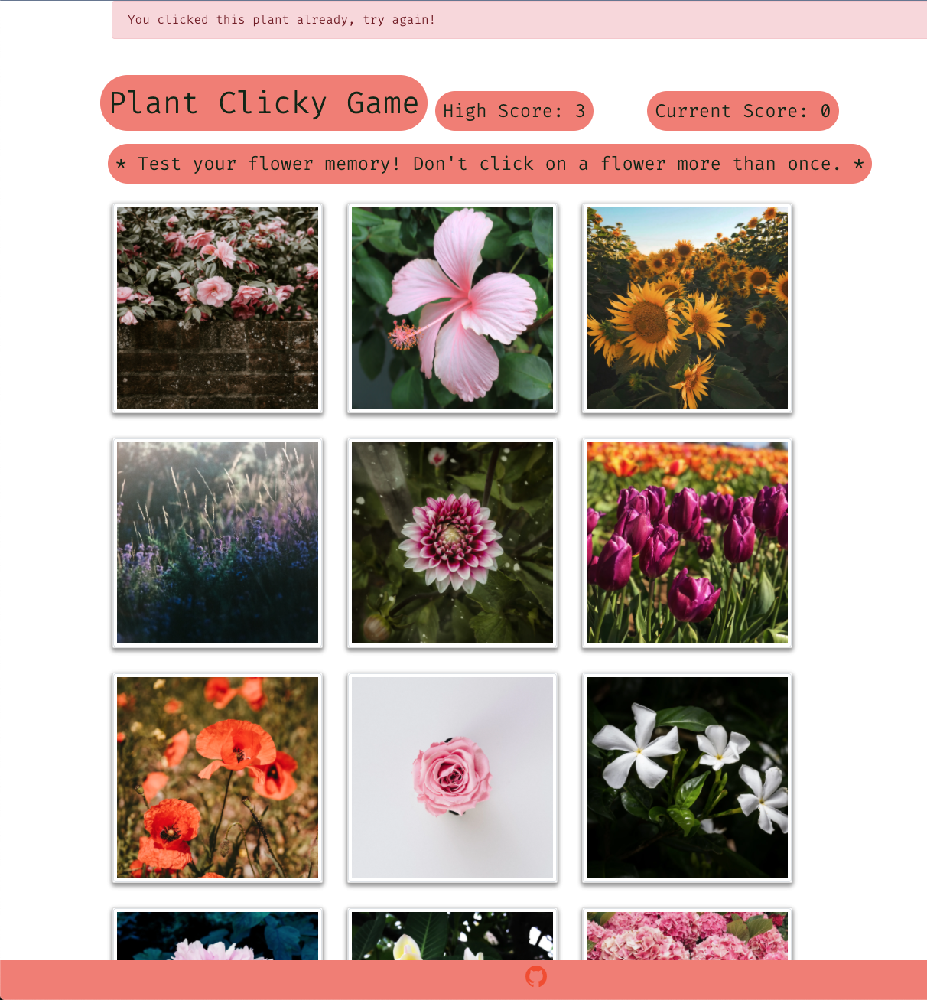
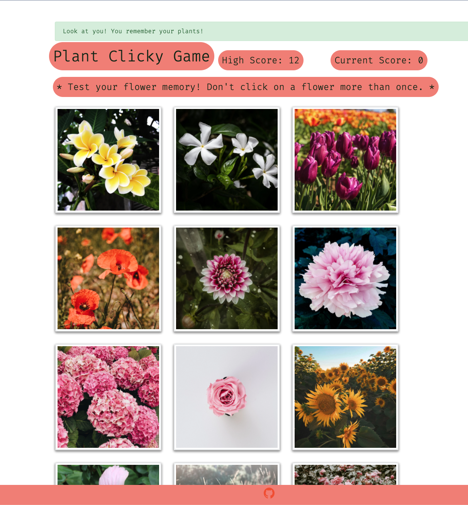

# Plant Clicky Game

## Test Your Memory of plants!

Plants and flowers are so wonderful to look at right?! You can test your memory with these plants and see if you can rememmber them all!

## How to Use

You will simply download the repository to your local computer and npm install the required packages. Open your terminal and the port will be waiting for you to click on it.

Once you arrive to the port given, you will see a scoreboard and 12 different flowers and plants. You will then click on each card and if you click on a card twice, you will get an alert notifying you that it's a duplicate.

If you make it all the way to 12 plants, you will get a success message!

The scoreboard will track your current score and your best score. So if you see score of 11 as your top score, keep pushin!

### Home page that displays the 12 cards and scoreboard

### Shows the message when you hit a duplicate

### Shows the message when you remember all 12 flowers and plants

## Technologies Used

- Javascript
- React.js
- JSX
- Bootstrap

## Code Logic

- NPM install the packages
- Use the terminal and type in npm start and it will load the port link
- There are three components of this page: Scoreboard, PlantCards, and Footer
- User will click on one of the cards to see if they match the correct plant ids shown in plant.json
  - If duplicate, the game will restart and top score will be inserted.
